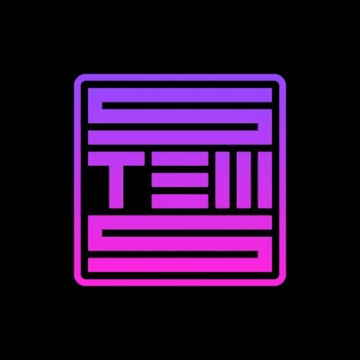
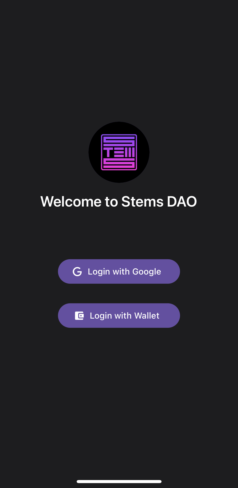

<!-- Improved compatibility of back to top link: See: https://github.com/othneildrew/Best-README-Template/pull/73 -->
<a name="readme-top"></a>
<!--
*** Thanks for checking out the Best-README-Template. If you have a suggestion
*** that would make this better, please fork the repo and create a pull request
*** or simply open an issue with the tag "enhancement".
*** Don't forget to give the project a star!
*** Thanks again! Now go create something AMAZING! :D
-->


<!-- PROJECT SHIELDS -->
<!--
*** I'm using markdown "reference style" links for readability.
*** Reference links are enclosed in brackets [ ] instead of parentheses ( ).
*** See the bottom of this document for the declaration of the reference variables
*** for contributors-url, forks-url, etc. This is an optional, concise syntax you may use.
*** https://www.markdownguide.org/basic-syntax/#reference-style-links
-->

<!-- PROJECT LOGO -->
<br />
<div align="center">
  <a href="#">
    
  </a>

<h3 align="center">Stems DAO</h3>

  <p align="center">
    An iOS app that allows users to log in using a Web3 wallet or Google Account, browse through a list of songs, and select one as their profile theme song.
  </p>
</div>


<!-- TABLE OF CONTENTS -->
<details>
  <summary>Table of Contents</summary>
  <ol>
    <li>
      <a href="#about-the-project">About The Project</a>
      <ul>
        <li><a href="#built-with">Built With</a></li>
      </ul>
    </li>
    <li>
      <a href="#getting-started">Getting Started</a>
      <ul>
        <li><a href="#prerequisites">Prerequisites</a></li>
        <li><a href="#installation">Installation</a></li>
        <li><a href="#local-development">Local Development</a></li>
      </ul>
    </li>
    <li><a href="#checklist">Checklist</a></li>
    <li><a href="#assumptions">Assumptions</a></li>
    <li><a href="#additional-features-i-would-add">Additional Features I Would Add</a></li>
  </ol>
</details>


<!-- ABOUT THE PROJECT -->
## About The Project

<div align="center">
  
</div>

This is a DEMO of Stems DAO React Native app, which will be mainly used on iOS devices.

Users can login using their Google account, or using their Web3 wallet. 

Authenticated users can select/play songs from a list of ten songs, and set song as profile theme song.

<p align="right">(<a href="#readme-top">back to top</a>)</p>


### Built With

* [React Native](https://reactnative.dev/)
* [Expo](https://expo.dev/)
* [Web3Auth](https://web3auth.io/)
* [Wallet Connect](https://walletconnect.com/)

<p align="right">(<a href="#readme-top">back to top</a>)</p>


<!-- GETTING STARTED -->
## Getting Started

Below are the instructions on setting up your project locally.
To get a local copy up and running follow these simple steps.


### Prerequisites

#### node version: 16.13.0

It is recommended to use [nvm](https://github.com/nvm-sh/nvm) to manage node version.

* npm
  ```sh
  npm install npm@16.13.0 -g
  ```

### Installation

1. Install NPM packages
  ```sh
   npm install
   ```
2. Install required global package
  ```sh
   npm install -g buffer
   ```
3. Run expo metro app
  ```sh
   npm start
   ```
4. After expo metro is running, press `i` on keyboard to run on simulator, or scan the QR code on your device. You need to have Expo Go installed to be able to run this on your device.

### Local Development

In order to use the Google login locally, you need to whitelist your IP address in the [Web3Auth dashboard](https://dashboard.web3auth.io/). You can add your IP in `Plug and play` -> `stemsDaoAssessment` -> `Whitelisted URLs`. If you are using a different project, you will need to update the `clientId` in order to use web3auth login.

You will be able to get your app IP address by trying the Google login on the app. The IP address will be displayed in the error message starting with `exp://` and ends with a port number. 

<p align="right">(<a href="#readme-top">back to top</a>)</p>


<!-- ROADMAP -->
## Checklist

- [x] User can login via wallet and google
- [x] User can select songs from a list of ten songs in a media player with a seekbar
- [x] User can set their profile theme song
- [x] User can change their profile theme song

<p align="right">(<a href="#readme-top">back to top</a>)</p>

<!-- Assumptions -->
## Assumptions

Here are few assumptions made during the development for a better demonstration purpose given the timeline.

- User will only select the songs stored in the app
- All data ( authentication information, theme song selection, etc ) is stored in memory. All data will be wiped after restarting the app.


## Additional Features I Would Add

1. Login functionality for all popular social media platforms.
2. Allowing users to upload the songs to select as their theme song.
3. Allowing users to select dark/light theme.
4. Since the platform already uses a web3 integration - allowing users to donate web3 tokens to music creators.
5. Improvements to the seek bar: Adding standard music player functions like 10 seconds forward, 10 seconds back, the time elapsed and time left
6. Building another player screen to show band details, song details, next song etc.

<p align="right">(<a href="#readme-top">back to top</a>)</p>
